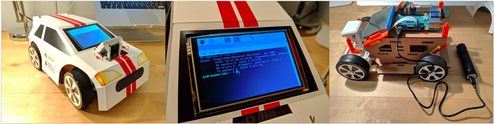

# car

Build an RC car using cardboard and 3D-printed parts; make it autonomous with Raspberry Pi and Python.

This repository contains all of the files and documentation you need to build a programmable RC car out of cardboard and 3D-printed parts.

There are four phases to this project. Please follow the links below for instructions on completing each phase.

1. [Cardboard parts](design_cardboard/)
2. [3D-printed parts](design_3d_print/)
3. [Cardware assembly](cardware_assembly/)
4. Code (coming soon)

## FAQ

### What materials and supplies do I need and how much will it cost to complete this project?
Please refer to the README pages for each phase, listed above.

### How long will it take me to complete this project?
It depends on whether you decide to:
- make the cardware parts yourself,
- pay a laser cutting and/or 3D printing service to make the parts for you, or
- (COMING SOON) buy a kit containing all of the parts ready for you to assemble. Assuming you spend 1-2 hours per day on this project, the first option might take you a week. The other two options will let you jump directly to Phase 3, after which you can probably start programming in a day or two.

### What can I do with this car?
- Program the Raspberry Pi to drive the car.
- Take pictures and video while driving.
- Collect images and train a neural network that will allow the car to drive itself along road lane markers.
- Incorporate or train your own image classification library to detect stop signs, pedestrians, and/or cats.
- Add additional hardware, such as distance sensors or even Lidar, to enhance self-driving features.

### I'm a parent/teacher. What can my student(s) learn from this project?
- Python programming
- Machine learning using image processing and neural networks
- 3D modeling and printing
- Basic robotics and car engineering
- Industrial design (e.g. car parts, chassis, and body)

### Am I free to make modifications to the files and code in this repo, and can I share my modifications/ideas with others?
Yes! This is an open source project. You are 100% free to do whatever you want with the stuff in this repo. Your creativity is enthusiastically encouraged. Please refer to the [license](LICENSE) for more details.

### I found some mistakes or I have questions about how to complete a step. Where can I request fixes, ask questions, or submit comments/suggestions?
For help with specific steps in the project or fix requests, please create an Issue (and please follow the template).
For other questions, comments, or suggestions, please email them to opencardware@gmail.com.
