# Drivetrain

### What you'll need

- continuous servo motor with the "+" shaped arm
- `gear_servo`
- `pin`
- `base_CENTER`

You'll also need the cardboard chassis. Orient it exactly like this.

Zip tie `base_CENTER` onto the chassis...

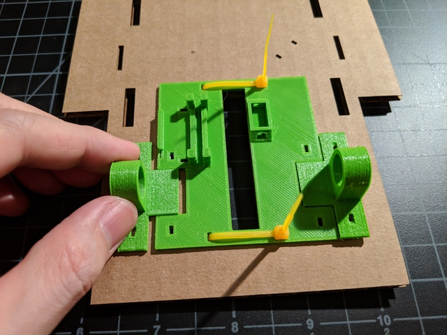

...as well as `base_LEFT` and `base_RIGHT`.

Prune the ends of the zip ties.

Affix the arm to the servo.

Then attach `gear_servo`.

Insert `pin`.

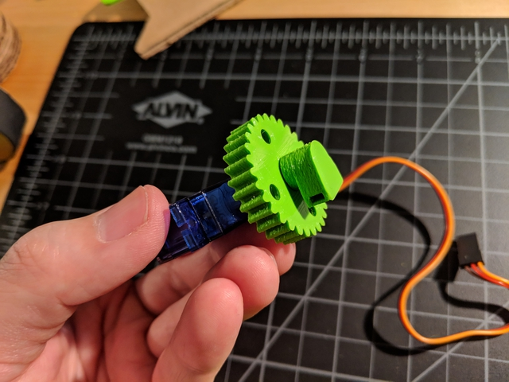

Plop those pieces down onto `base_CENTER`, making sure the brim of the servo fits between the guards (see arrows in image below). Press `pin` firmly down into the hole where it sits.

Loop a zip tie through `base_CENTER` and `pin`, and close the zip tie. Prune.

Connect two zip ties, as shown, and feed the vertical end downward into the hole going through `base_CENTER` and the chassis.

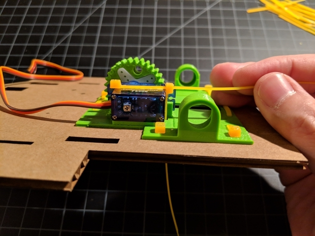

Bring that end back up through the chassis and `base_CENTER`, connecting it to the other zip tie. Pull through firmly so that the servo is securely tied down.

Get the two `ring` pieces.

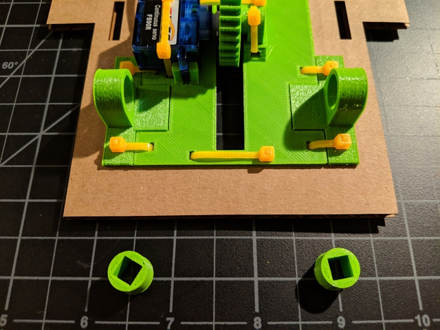

Insert them into the wells of `base_LEFT` and `base_RIGHT`. To ease entry, you may want to have the top (relative to how it was printed) of the `ring` go in first.

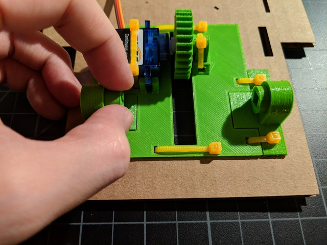

Lower `gear_shaft` into the middle hole.

Feed the `shaft` through the `ring`, then `gear_shaft`, and then the other `ring`.

Your drivetrain should now look like this. Confirm that the two gears mesh by turning the `shaft` with your hand.

Loop a zip tie through two `stay` pieces and the `shaft`, like so. NOTE: Your `stay` pieces may look a bit different (e.g. "L" shaped).

Tie firmly. This will keep the `shaft` and `ring` pieces from sliding.

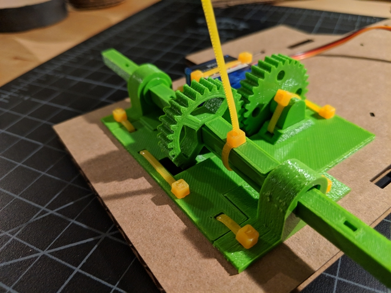

Do the same for the other side.

Prune the zip ties.

Get five wheel wheel discs and `bolt`. 

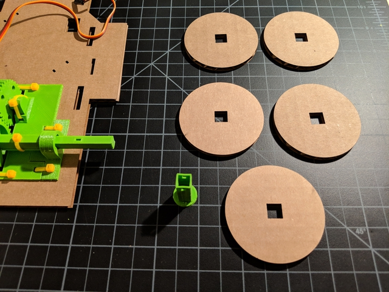

Cut out a tire rim and glue it to one of the discs.

Like so.

Insert the `bolt` into the disc.

Then add the other four discs.

You now have a wheel.

Put a rubber band (tire) on the wheel.

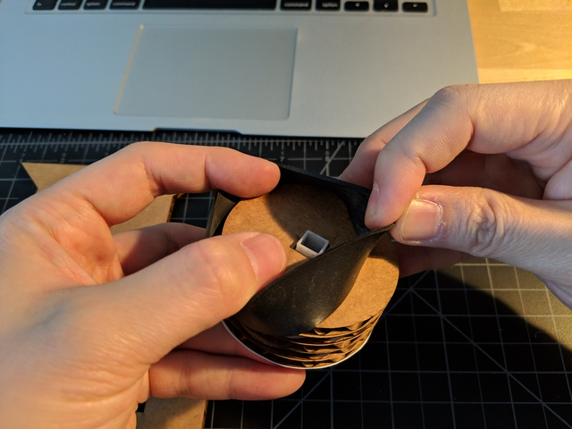

Like so.

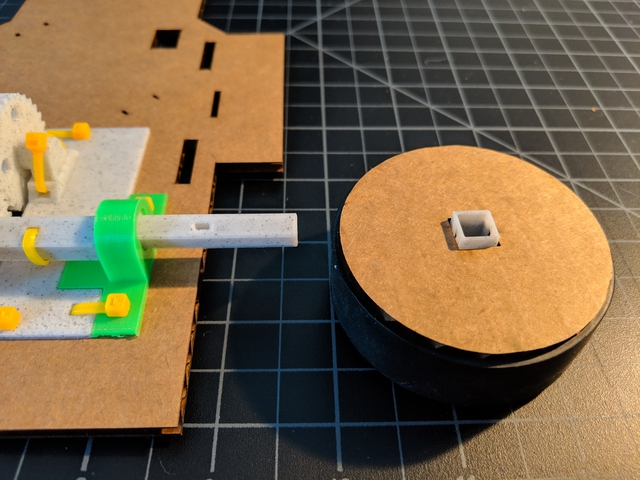

Mount the wheel on the shaft.

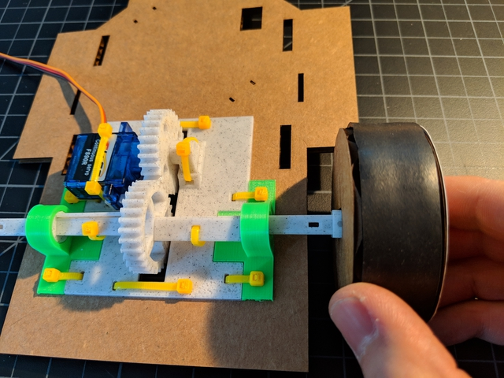

Make sure the holes line up.

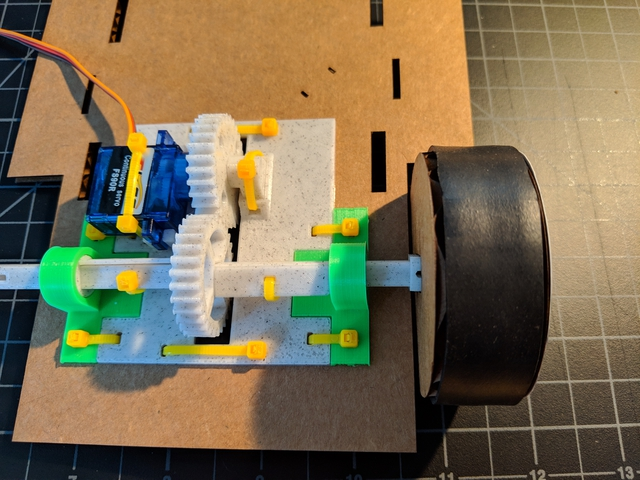

Thread a zip tie through the holes.

Close the zip tie.

Prune the zip tie. Now repeat the process for the other wheel.

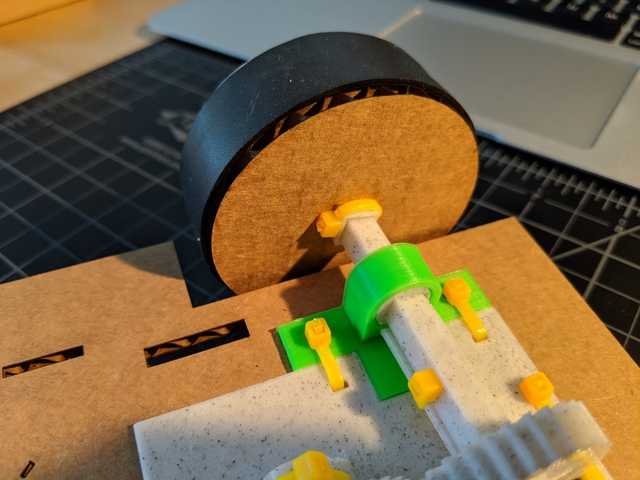

Once you've mounted both wheels, you'll need the two `battery_corner` pieces.

They'll go on the holes in the center of the chassis.

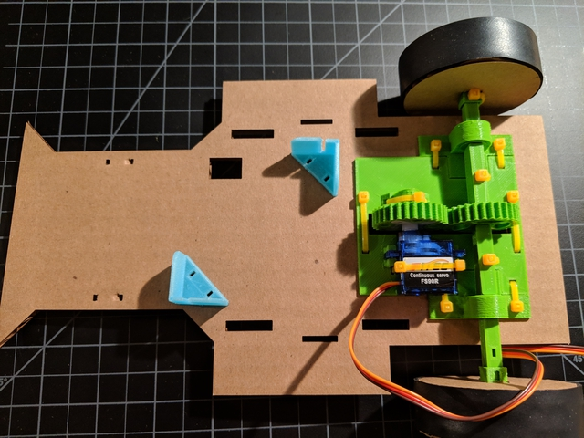

Loop a zip tie through each `battery_corner`. Make sure the zip tie buckle is on the bottom of the chassis.

The top should look like this. Repeat for the other `battery_corner`.

