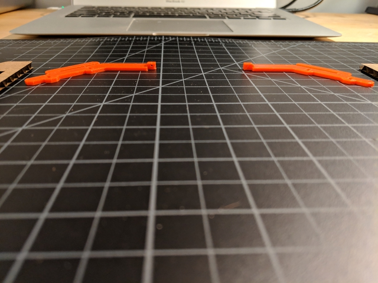
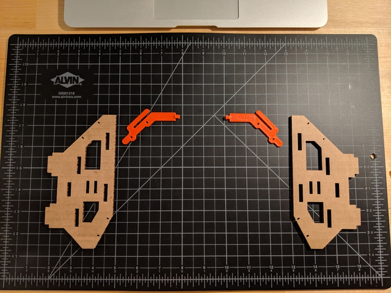
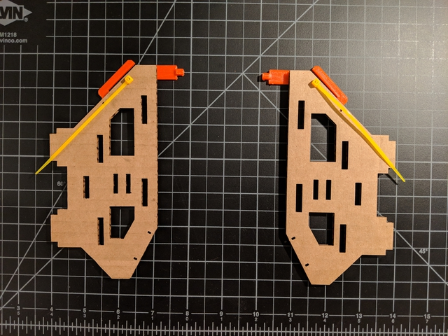
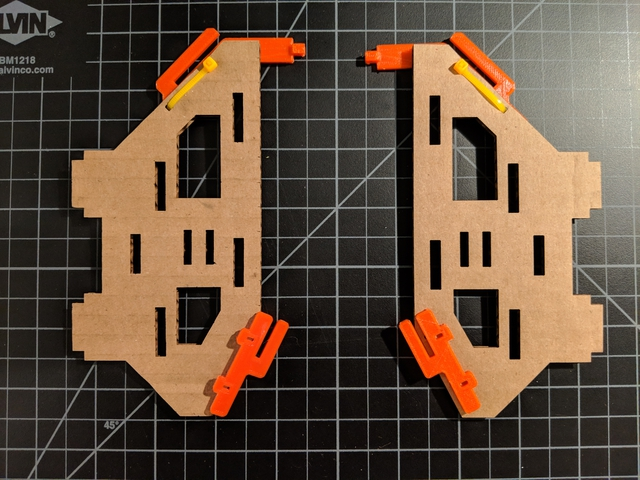
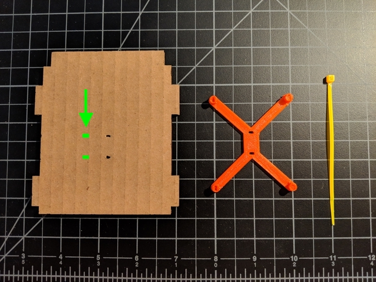
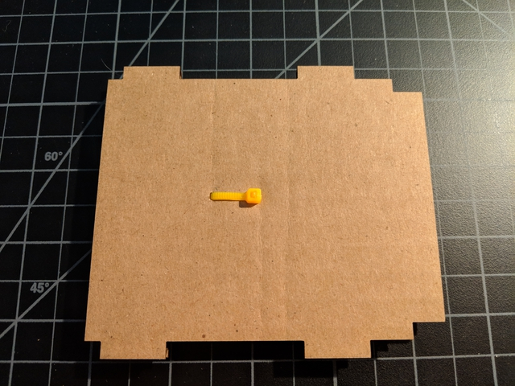
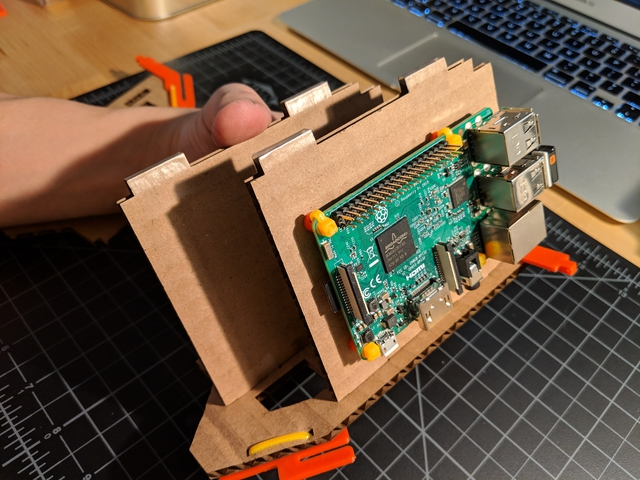
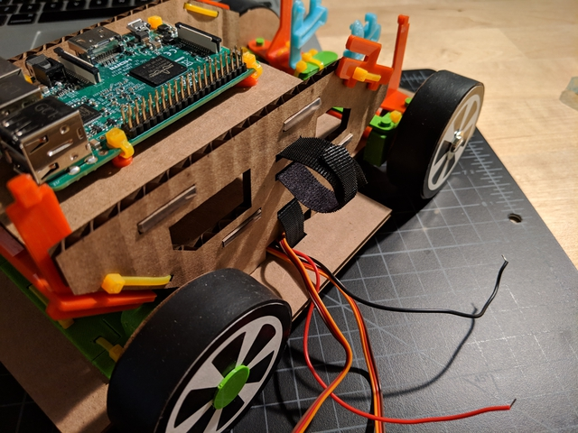
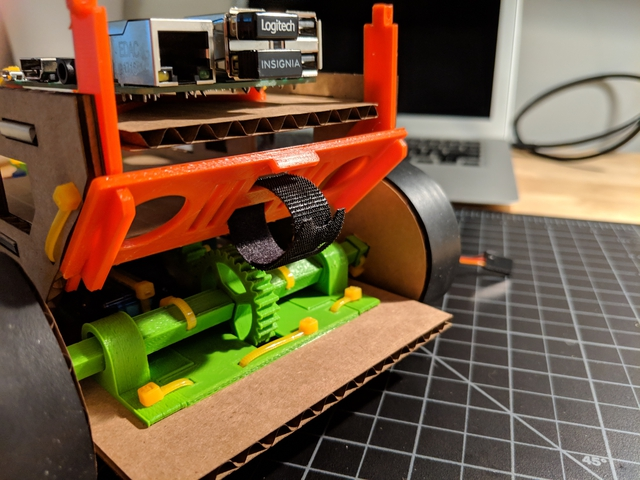

# Mounts

### What you'll need

- [mount parts](../../design_3d_print/README.md)
- Raspberry Pi (with prepared microSD card inserted)
- chassis with drivetrain, steering, and battery pack fully assembled
- velcro straps (3)

Get `Y_bracket_REAR_L` and `Y_bracket_REAR_R`, and orient them like so.

Get the two cardboard pieces for the carriage sides.

Lay them on top of `Y_bracket_REAR_L` and `Y_bracket_REAR_R`.

Lay zip ties with their buckles oriented like so.

Loop and close the zip ties. Prune.

Get the two `Y_bracket_FRONT` pieces and lay them like so.

Zip tie them in. Prune.

Get a cardboard shelf, `pi_mount`, and a zip tie. NOTE: Your cardboard shelf may have holes that are a bit off-center (see the green marks in the image below). If so, you'll want to orient the shelf exactly as shown in the image, and the `pi_mount` should be lowered on top of it before being zip-tied.

Thread the zip tie from the bottom up.

Close the zip tie.

Prune.

Get four zip ties. Again, if your shelf had off-center holes, then confirm that they're oriented exactly as shown in the image below.

Thread zip ties through the holes of the `pi_mount`. If you find it difficult to get the zip ties to go through, use a paper clip or something similar to clean out any messy filament that may be impeding the zip tie's path.

Lower your Pi down onto the zip ties. Cat's paw shown for scale.

Prune. NOTE: If your zip ties break or you find it difficult to tie all four, this should be fine. As long as you have at least two opposing corners tied down, you should be good.

Apply scotch tape on the feet of the two shelves (one with the Pi and one without). This will make it easier to insert them into the carriage sides.

Closer look at the tape.

Also apply scotch tape to the feet of the carriage sides (both of them).

Closer look, again.

Lay down and orient the four major pieces like so.

Insert the bottom shelf into the bottom holes of one of the carriage side pieces.

Then insert the top shelf (with the Pi) into the top holes of the carriage side.

Lower the other carriage side onto the shelves.

Go back to your chassis and straighten out the wires from the servo motors and the battery pack.

Get the velcro strap and make it about 12" (34 cm) long.

Thread in the strap from the bottom of the chassis like so.

Pull through about this much.

Thread it through one hole in the carriage...

...and out the other.

Then thread it back down the chassis.

Should look like this.

Lower the carriage's feet into the corresponding holes in the chassis, and make sure the wires escape through the hole on the side. Cut a velcro strap in half and thread it through the holes on the carriage side with the wires.

Join the velcro straps.

Firmly, like so.

Take the other half of the velcro strap you cut and thread it through the `battery_door`.

Slide the `battery_door` into the tracks of `Y_bracket_REAR_L` and `Y_bracket_REAR_R`.

