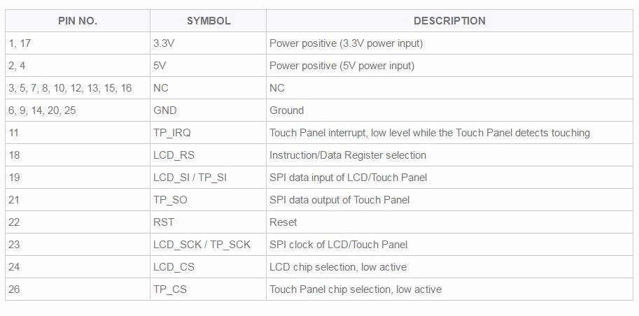

# Wiring

### What you'll need

- Raspberry Pi
- microSD card containing Raspbian OS image
- LCD screen (3.5") for Raspberry Pi
- jumper wires (15)

Connect the power (red) and ground (black) wires to the power supply pins on the breadboard.

Secure them by taping them down.

Attach male-male jumper wires to the power and ground pins of the two servo motors.

Feed the wires from the servos through the side of the carriage, like so.

Plug them into the power supply pins of the breadboard.

Use a male-female jumper wire to connect the breadboard's ground to the Pi's ground. Locate the ground pins on the Pi using this [site](https://pinout.xyz/#).

Use male-female jumper wires to extend the servos' signal wires.

Tuck the breadboard into the carriage.

Get the LCD screen and 12 male-female jumper wires.

This table shows the pin interface for the LCD screen. The LCD normally sits on top of the Pi, covering 26 of the GPIO pins. We're only going to connect the 12 pins we need to make the LCD work with the Pi.

The "PIN NO." column lists the 12 pins that need to be connected. Each row in this column lists the pin number(s) on the Pi that can do the job required for that "SYMBOL". (For simplicity's sake, I went with the first number in each row.) Again, you can use this [site](https://pinout.xyz/#) for reference on the Pi's GPIO pin numbers.

Use tape to secure the pins in place on the LCD.

Feed the wires through LCD mount, like so.

Slide the LCD mount into the corresponding mounts on the carriage.

Lower the LCD into the mount...

...like so.

Connect the jumper wires from the LCD into Pi's GPIO pins (should correspond exactly with the pin locations on the LCD).

Should look like this when you're done.

Plug in the USB battery charger.

After inserting the micro SD card with the OS installed, turn on the USB battery to boot up the Pi.

Connect to Wi-Fi.

Open the Terminal and find out the IP address of your Pi. Use that IP address to SSH into your Pi for easier code editing.

