# Wiring

### What you'll need

- Raspberry Pi
- microSD card containing Raspbian OS image
- LCD screen (3.5") for Raspberry Pi
- jumper wires (14)

Connect the power (red) and ground (black) wires to the power supply pins on the breadboard.

Secure them by taping them down.

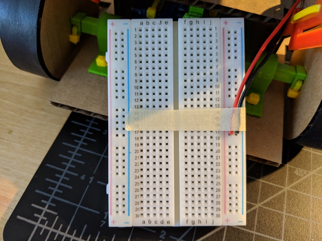

Attach male-male jumper wires to the power and ground pins of the two servo motors.

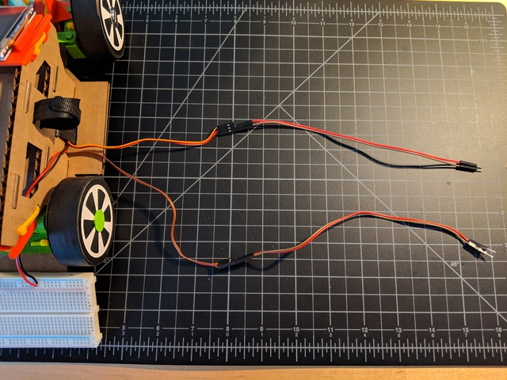

Feed the wires from the servos through the side of the carriage, like so.

Plug them into the power supply pins of the breadboard.

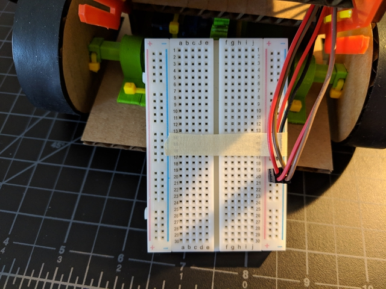

Use a male-female jumper wire to connect the breadboard's ground to the Pi's ground. Locate the ground pins on the Pi using this [site](https://pinout.xyz/#).

Use male-female jumper wires to extend the servos' signal wires.

Tuck the breadboard into the carriage.

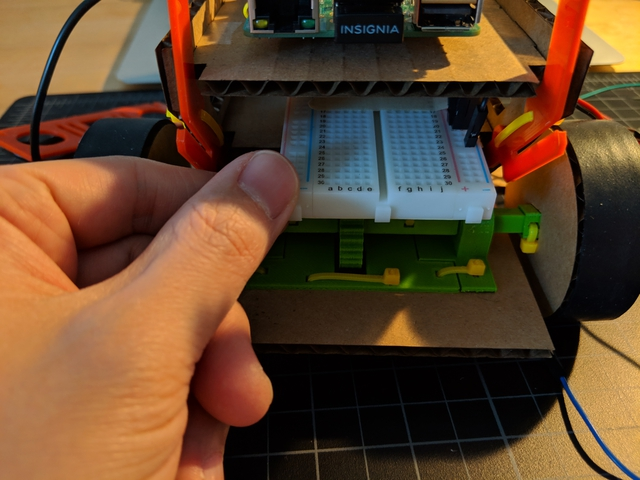

Get the LCD screen and 12 male-female jumper wires.

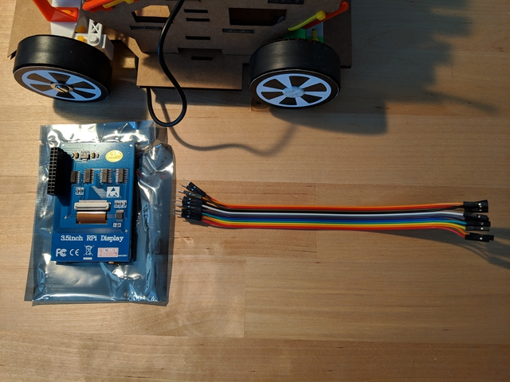

MVIMG_20190310_143657_resized.jpg

MVIMG_20190310_143921_resized.jpg

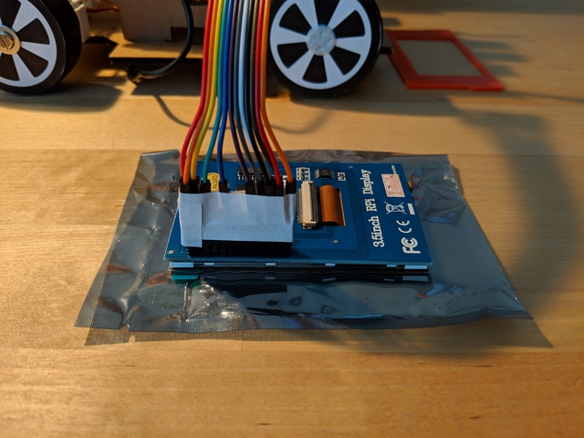

MVIMG_20190310_144009_resized.jpg

MVIMG_20190310_144203_resized.jpg

MVIMG_20190310_144234_resized.jpg

MVIMG_20190310_144618_resized.jpg

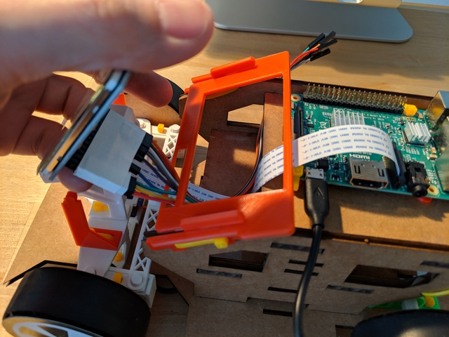

MVIMG_20190310_144627_resized.jpg

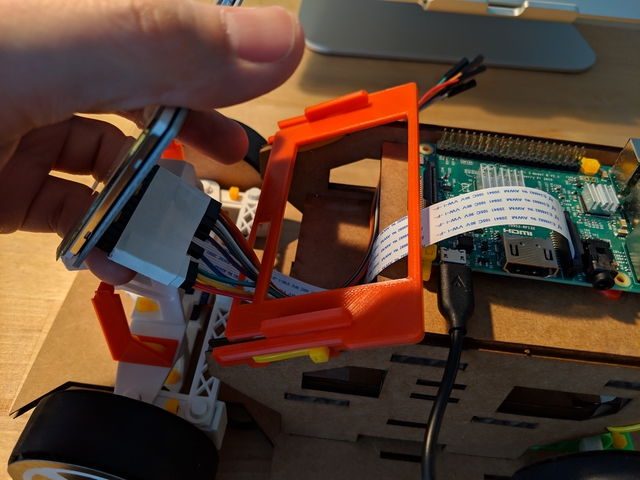

MVIMG_20190310_144754_resized.jpg

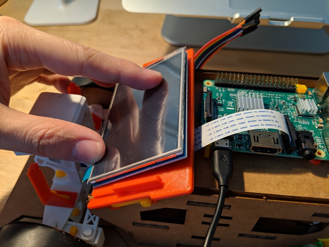

MVIMG_20190310_144859_resized.jpg

MVIMG_20190310_145224_resized.jpg

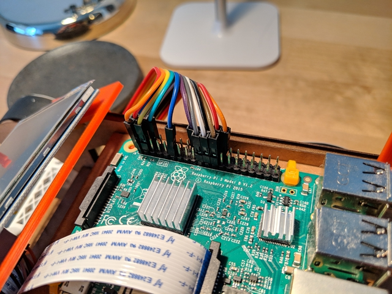

MVIMG_20190310_183959_resized.jpg

MVIMG_20190310_145837_resized.jpg

MVIMG_20190310_182400_resized.jpg

MVIMG_20190310_182437_resized.jpg

MVIMG_20190310_142923_resized.jpg

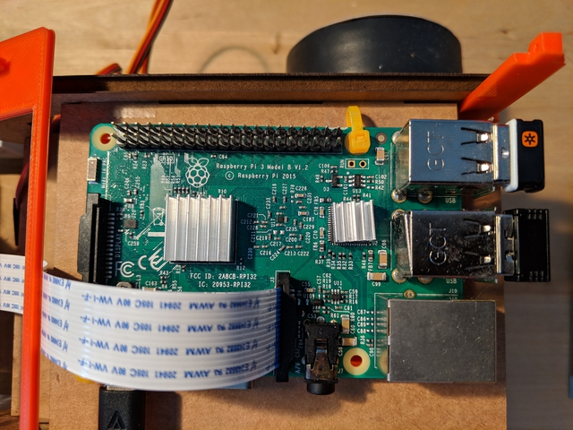

MVIMG_20190310_142933_resized.jpg

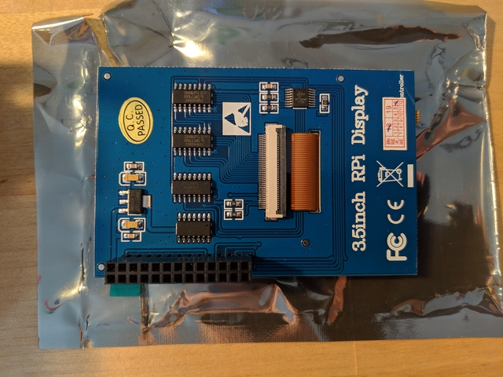

